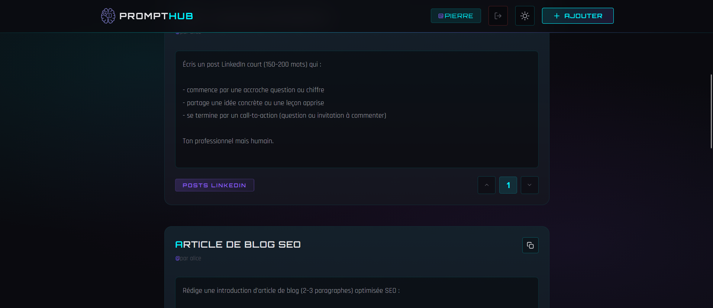
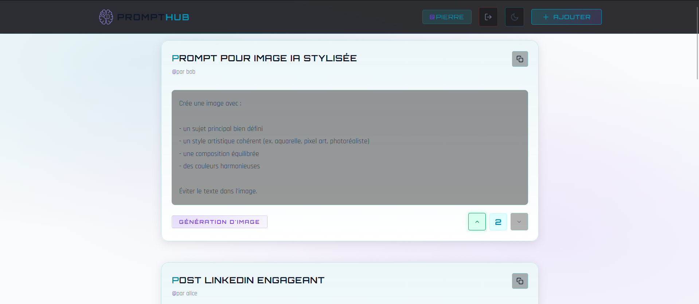

# Prompt Hub — Frontend

Application Angular de partage et de découverte de prompts. Permet de parcourir, créer, éditer et voter sur des prompts organisés par catégories.

Projet réalisé à partir du tutoriel de **[Gaëtan Rouziès](https://www.youtube.com/@GaetanRouzies)**, puis personnalisé et étendu avec des fonctionnalités supplémentaires (authentification complète, système de votes, feedback utilisateur, optimisations de performance).

## Apercu

**Thème sombre**



**Thème clair**



## Stack technique

| Technologie | Version | Role |
|-------------|---------|------|
| Angular | 21.2 | Framework frontend |
| TypeScript | 5.9 | Langage principal |
| RxJS | 7.8 | Programmation reactive |
| Vitest | 4.0 | Tests unitaires |
| Prettier | 3.8 | Formatage du code |
| SCSS | — | Styles avec variables CSS custom |

## Fonctionnalites

- **Authentification** — Inscription, connexion et deconnexion via JWT (cookies httpOnly)
- **CRUD de prompts** — Creation, lecture, mise a jour et suppression
- **Restriction par auteur** — Seul le createur d'un prompt peut le modifier ou le supprimer
- **Systeme de votes** — Upvote / downvote avec toggle (un seul vote actif par utilisateur)
- **Categorisation** — Organisation des prompts par categories
- **Theme clair / sombre** — Basculement avec persistance dans `localStorage`
- **Feedback utilisateur** — Notifications toast (succes, erreur, info)
- **Copie presse-papier** — Copie rapide du contenu d'un prompt
- **Responsive design** — Adapte mobile, tablette et desktop
- **Lazy loading** — Chargement differe des routes et des composants
- **`@defer` blocks** — Chargement viewport/idle des cards et du toast
- **OnPush** — Change detection optimise sur tous les composants

## Architecture

```text
src/app/
├── auth/
│   ├── auth-form/          # Page connexion / inscription
│   ├── auth.service.ts     # Gestion de l'etat auth (signals)
│   ├── auth.guard.ts       # Guard fonctionnel de route
│   ├── auth.interceptor.ts # Injection withCredentials
│   └── user.model.ts       # Interface User
├── prompts/
│   ├── prompt-list/        # Liste des prompts (route principale)
│   ├── prompt-card/        # Carte individuelle (display + edit)
│   ├── prompt-form/        # Formulaire de creation
│   ├── prompt-service.ts   # Appels API (CRUD + votes)
│   ├── prompt.models.ts    # Interface Prompt
│   ├── category-service.ts # Appels API categories
│   └── category.models.ts  # Interface Category
├── shared/
│   ├── toast.service.ts    # Service de notifications (signals)
│   └── toast/              # Composant toast
├── navbar/                 # Barre de navigation
├── app.routes.ts           # Routing (lazy loading)
├── app.config.ts           # Providers (interceptors, router)
├── app.ts                  # Composant racine
└── theme.service.ts        # Gestion du theme clair/sombre
```

## Routes

| Chemin | Composant | Guard | Description |
|--------|-----------|-------|-------------|
| `/` | — | — | Redirection vers `/prompts` |
| `/auth` | AuthForm | — | Connexion / inscription |
| `/prompts` | PromptList | — | Liste des prompts |
| `/prompts/create` | PromptForm | `authGuard` | Creation d'un prompt |
| `**` | — | — | Redirection vers `/prompts` |

## Demarrage

### Prerequis

- Node.js 18+
- npm 10+
- Le backend Prompt Hub lance sur le port 3000

### Installation

```bash
npm install
```

### Lancement

```bash
# Mode developpement
npm start
```

L'application est accessible sur `http://localhost:4200/`.

### Tests

```bash
# Lancer les tests (execution unique)
npm test

# Build de production
npm run build
```

### Formatage

```bash
npm run format
```

## Configuration

Les fichiers d'environnement se trouvent dans `src/environments/` :

```typescript
// environment.development.ts
export const environment = {
  apiUrl: 'http://localhost:3000/'
}
```

L'authentification utilise des cookies httpOnly. L'intercepteur HTTP ajoute automatiquement `withCredentials: true` sur toutes les requetes.

## Performance

Le bundle est optimise avec les techniques suivantes :

- **Lazy loading des routes** — Chaque page est un chunk separe (`auth-form`, `prompt-form`, `prompt-list`)
- **`@defer (on viewport)`** — Les prompt cards se chargent au scroll avec un skeleton placeholder
- **`@defer (on idle)`** — Le toast est charge quand le navigateur est idle
- **`@defer (on immediate)`** — Le formulaire d'edition inline est charge apres le premier rendu
- **`ChangeDetectionStrategy.OnPush`** — Sur tous les composants (reduction des re-renders)
- **`computed()` signals** — Valeurs memoisees au lieu de getters classiques

## Remerciements

Projet initie a partir du tutoriel Angular de **[Gaetan Rouzies](https://www.youtube.com/@GaetanRouzies)** — [Video de la formation](https://www.youtube.com/watch?v=3llJm3LO1e4). La base du projet (initialisation, structure, concepts fondamentaux) provient de sa chaine YouTube. Le projet a ensuite ete personnalise et etendu avec l'authentification complete, le systeme de votes, les guards, les feedbacks utilisateur et les optimisations de performance.
